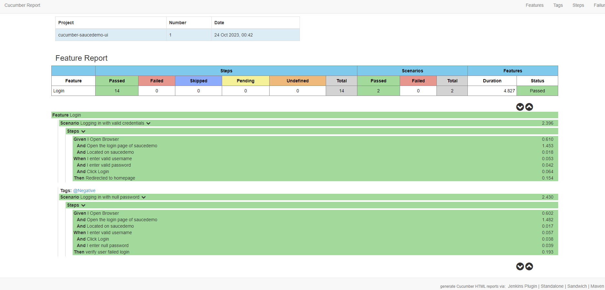
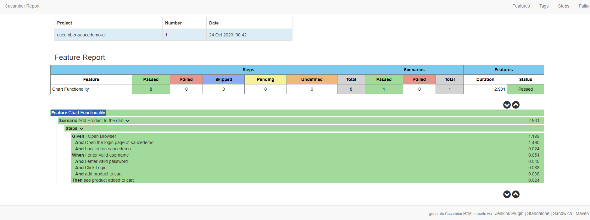
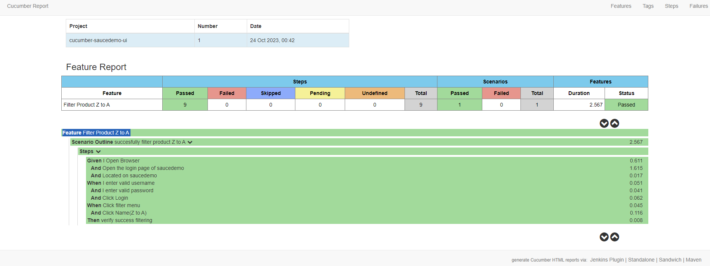
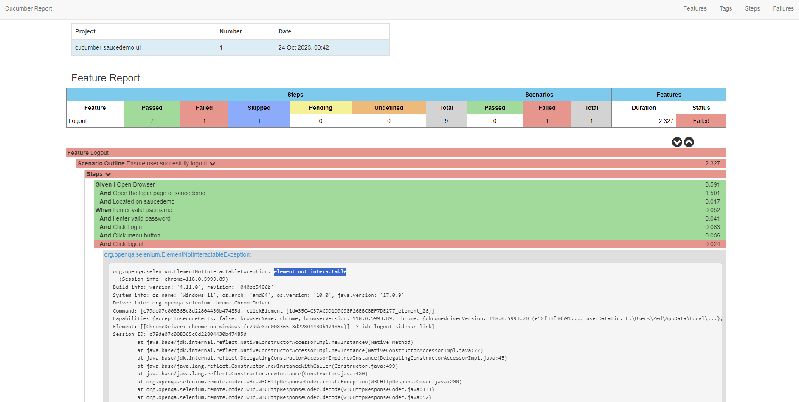

# saucedemo-automation
homework 6 - saucedemo

1.	Feature Login + Negative
 
2.	Feature Product Checkout functionality
 
3.	Feature Chart Functionality
 
4.	Feature Filter Product
  
5.	Feature Logout (still getting Error element not interactable. tried to use xpath, classid, classname)
 
